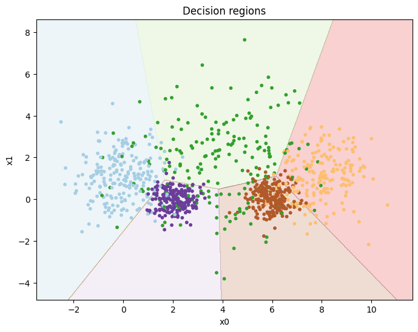
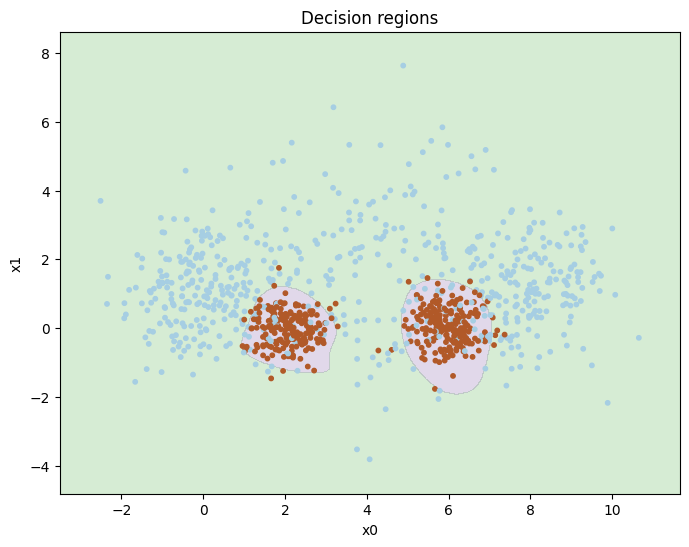
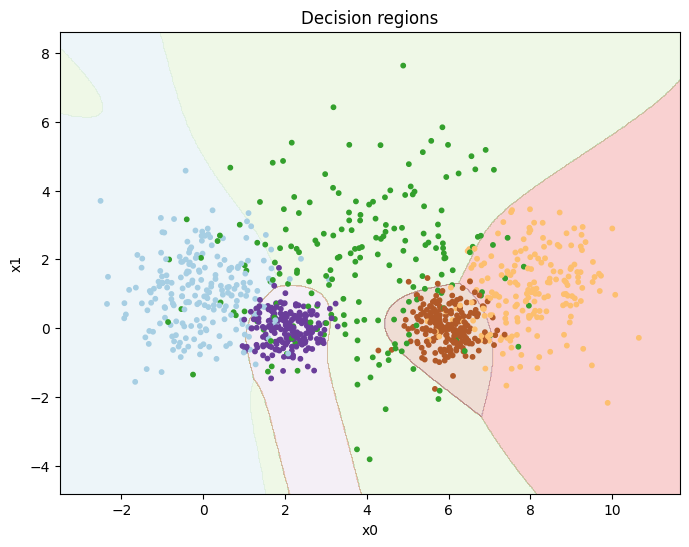

# Linear Vs. MLP-classification

Exploring supervised learning using gradient descent. It compares linear classifiers with multi-layer perceptron (MLP) and examines binary versus multi-class classification. A key focus is implementing and understanding the backpropagation algorithm in neural networks.

See images show training different models, and their results: <br>



> One-vs-rest for a Multinomial logistic regression <br>




> Multi-layer perceptron for binary classification - 93.2% accuracy <br>




> Multi-class feed forward neural network with high accuracy 


## Results from comparing models

Here are the result from comparing the different types of classifiers on both a binary dataset and a multi-class dataset.

### Binary Classification

```text
Accuracy
Classifier               Training Set        Validation Set      Test Set            
================================================================================
Linear Regression        0.6850              0.6540              0.6500              
Logistic Regression      0.7200              0.7540              0.7240              
Multi-Layer Classifier   0.9360              0.9360              0.9000              

Precision
Classifier               Training Set        Validation Set      Test Set            
================================================================================
Linear Regression        0.5658              0.5346              0.5322              
Logistic Regression      0.6623              0.6866              0.6595              
Multi-Layer Classifier   0.9035              0.9298              0.8930              

Recall
Classifier               Training Set        Validation Set      Test Set            
================================================================================
Linear Regression        0.9556              0.9747              0.9239              
Logistic Regression      0.6296              0.6970              0.6193              
Multi-Layer Classifier   0.9145              0.9409              0.9059              
            
```

### Multi-Class Classification

```text
Accuracy
Classifier                         Training Set        Validation Set      Test Set            
====================================================================================================
One-vs-Rest Classifier             0.7830              0.8260              0.7680              
Multinomial Logistic Regression    0.6710              0.7380              0.6600              
Multi-Class Neural Network         0.8630              0.8800              0.8380              

Precision
Classifier                         Training Set        Validation Set      Test Set            
====================================================================================================
One-vs-Rest Classifier             0.7830              0.8260              0.7680              
Multinomial Logistic Regression    0.7430              0.8049              0.7319              
Multi-Class Neural Network         0.8643              0.8779              0.8406              

Recall
Classifier                         Training Set        Validation Set      Test Set            
====================================================================================================
One-vs-Rest Classifier             0.7830              0.8260              0.7680              
Multinomial Logistic Regression    0.6676              0.7240              0.6794              
Multi-Class Neural Network         0.8620              0.8776              0.8491                     
```